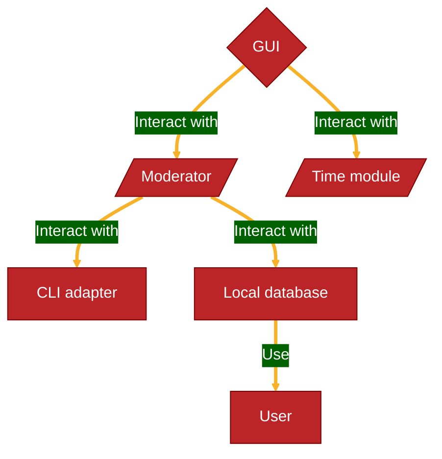
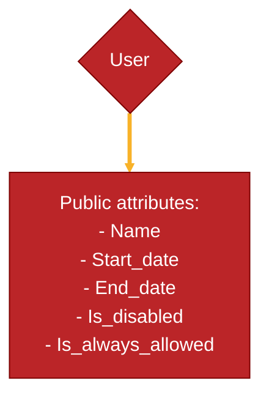
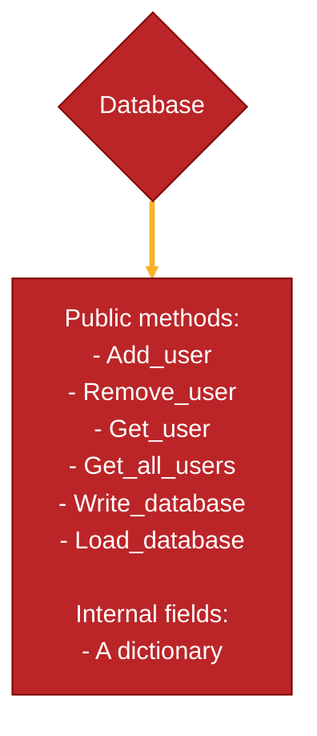
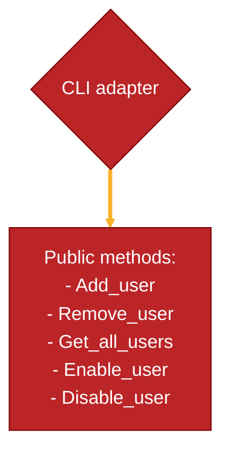
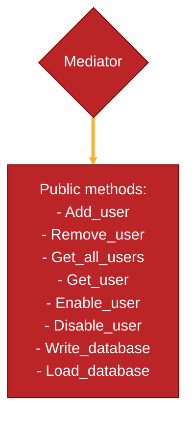
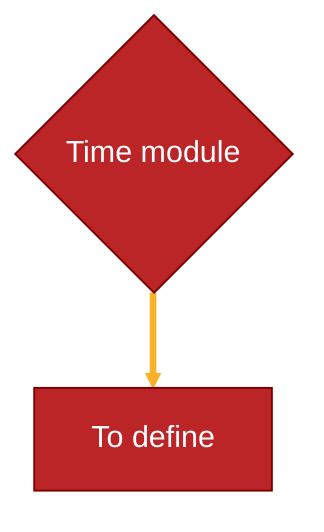

# Application modules UML

I wanna treat the graphic part as a layer that interact with the others modules,
for this reason it will not be analyzed in this paper.

At the moment the project doesn't involves to manage a lot of users

## Functionality to implement

From the GUI I must be able to:

- Add new users and set a Time-To-Live for their connections (for example: Marco
   can use the VPN for 20 days)
- Retreive for every user the configuration file for the VPN
- Automatcly disable users with Time-To-Live = 0
- Display users status
- Manualy remove/disable Users

## UML scheme

## Single module scheme

